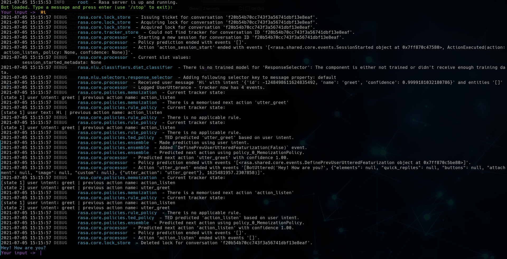
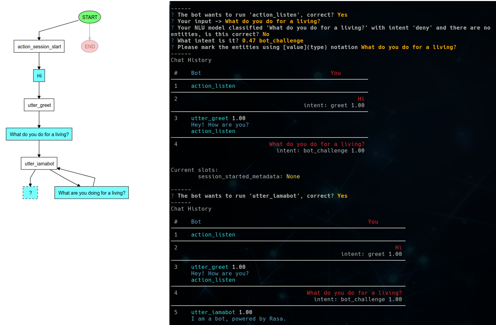
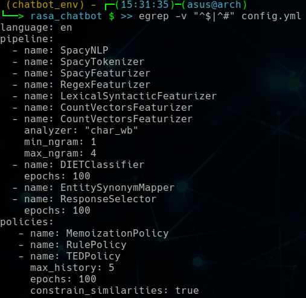
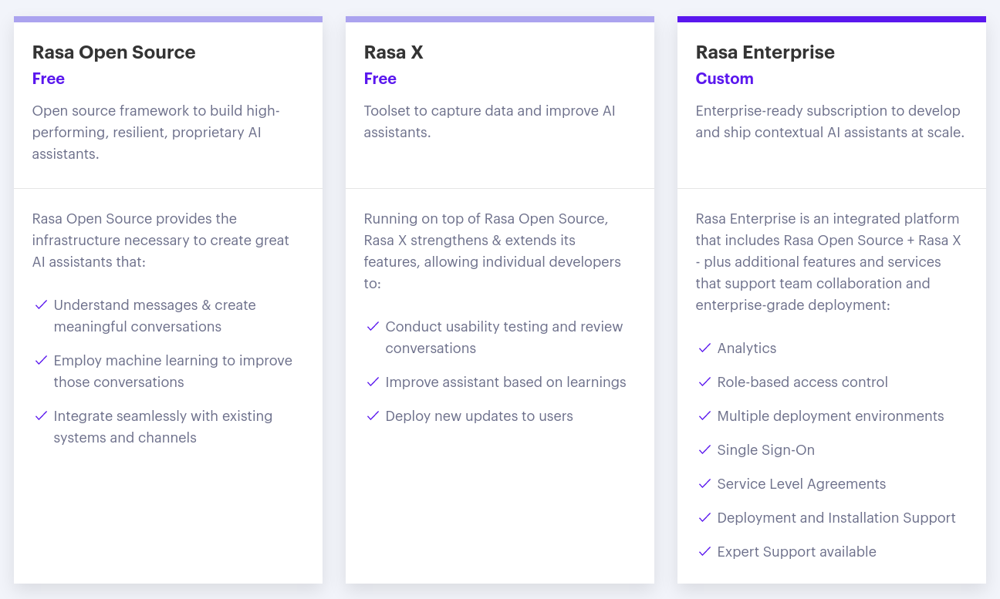
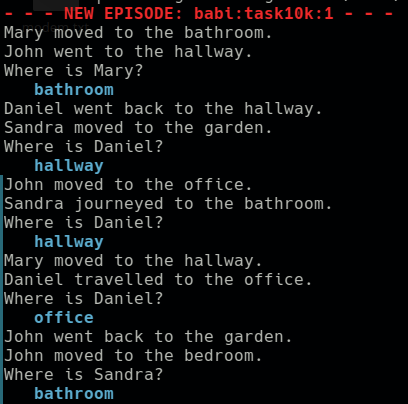
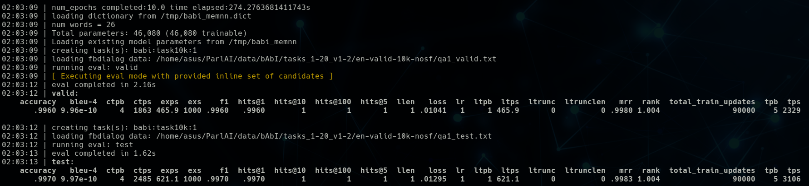
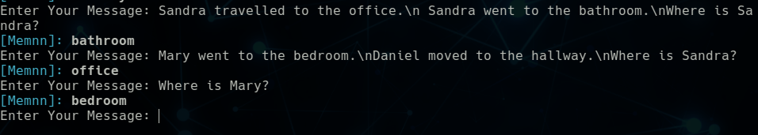
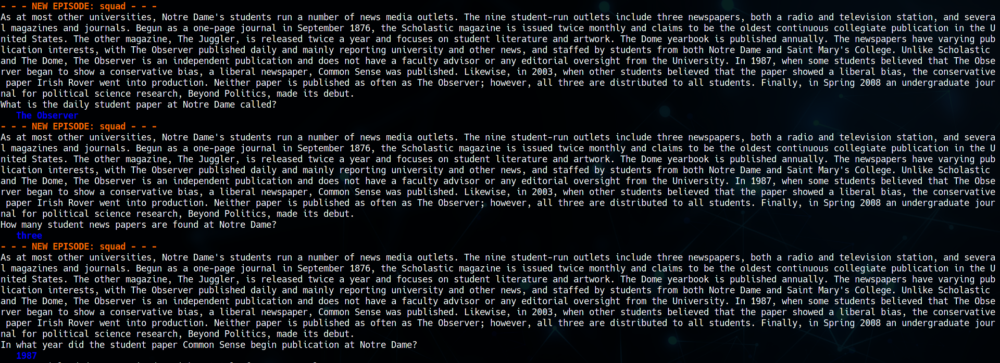
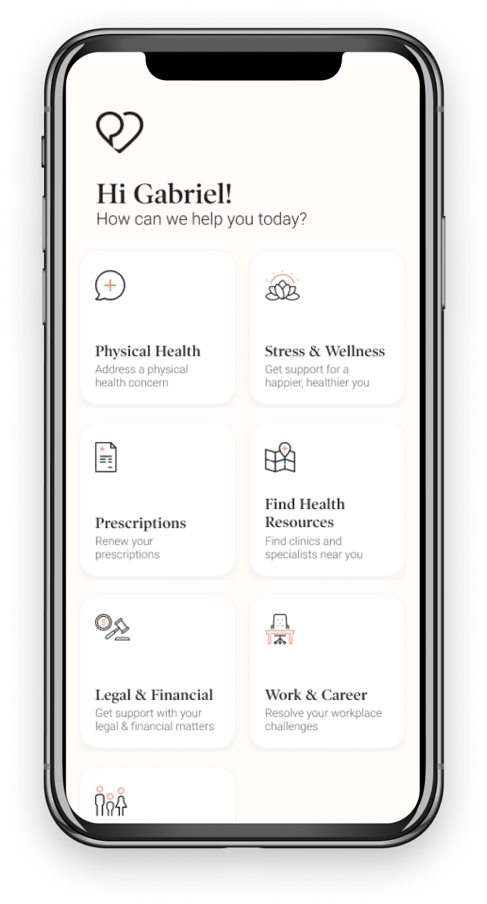
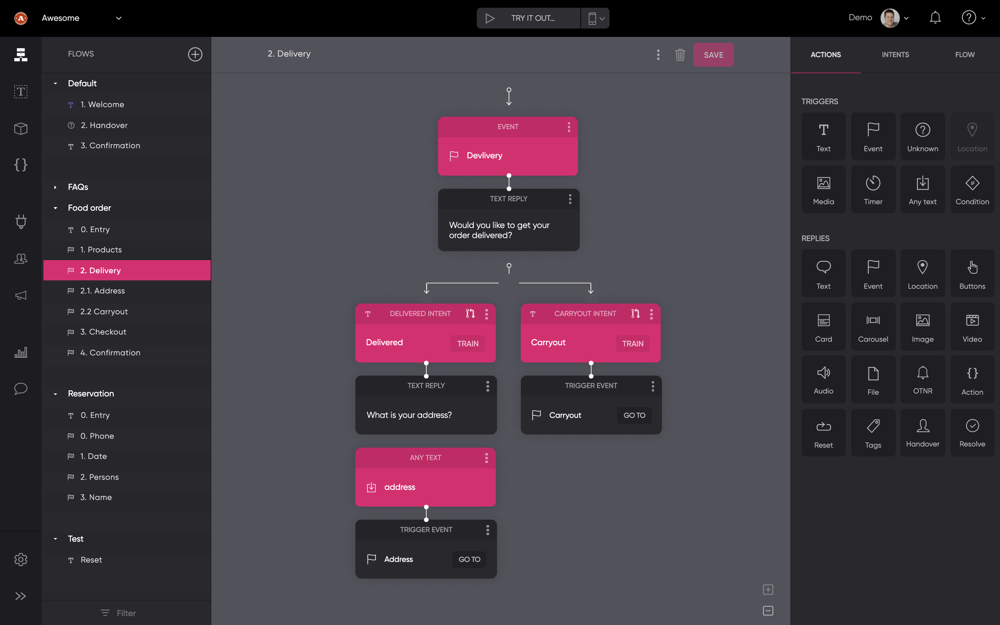

# Rasa Platform

## Pros
- Support both text and voice-based conversations
- Great commandline tools for:
    - Training
    - Testing
    - Finetuning
    - Data processing
    - Debugging
    - 

- Include interactive shell for visualization, debugging and data generating purposes
    - 

- Include policy visualization tools for visualizing what so-called happy path
    - 

- Easy to configure pipeline and policies

    |  config.yml  | Component Lifecycle  |
    |------------|-------------|
    |  |  |

- Supporting many messaging and voice channels by default:
    - Your Website
    - Facebook Messenger
    - Slack
    - Telegram
    - Twilio
    - Microsoft Bot Framework
    - Cisco Webex Teams
    - RocketChat
    - Mattermost
    - Google Hangouts Chat
    - Custom Connectors

- Supporting CDD for real data generation by Rasa X platform
    - Conversation-Driven Development (CDD) is the process of listening to your users and using those insights to improve your AI assistant.
    - CDD includes the following actions:
        - Share your assistant with users as soon as possible
        - Review conversations regularly
        - Annotate messages and use them as NLU training data
        - Test that your assistant always behaves as you expect
        - Track when your assistant fails and measure its performance over time
        - Fix how your assistant handles unsuccessful conversations

- Tools for handling unexpected conversation paths
    - Handling Out-of-scope Messages with *out_of_scope* intent
    - Fallbacks to handle incoming messages with low NLU confidence.
    - 
    - Support machine-learning-based policies such as the TED Policy.
    - Human Handoff
    - Handling contextual interjections with *requested_slot*

- Reaching out first
    - 
- External Events
    - Sometimes, you want an external device to change the course of an ongoing conversation. For example, if you have a moisture-sensor attached to a Raspberry Pi, you could use it to notify you when a plant needs watering via your assistant.

- Reminders
    - You can have your assistant reach out to the user after a set amount of time using Reminders.

- Support many components by default:
    - Language Models
        - MitieNLP
        - SpacyNLP
    - Tokenizers
        - WhitespaceTokenizer
        - JiebaTokenizer
        - MitieTokenizer
        - SpacyTokenizer
    - Featurizers
        - MitieFeaturizer
        - SpacyFeaturizer
        - ConveRTFeaturizer
        - LanguageModelFeaturizer (HuggingFace's Transformers)
            - BERT
            - GPT
            - GPT-2
            - GPTNeo
            - Transformer-XL
            - XLNet
            - XLM
            - DistilBERT
            - CTRL
            - CamemBERT
            - ALBERT
            - T5
            - XLM-RoBERTa
            - RoBERTa
            - FlauBERT
            - Bart
            - BARThez
            - DialoGPT
            - Reformer
            - M2M100
            - MarianMT
            - Pegasus
            - Longformer
            - MBart
            - Lxmert
            - Funnel Transformer
            - LayoutLM
            - DeBERTa
            - SqueezeBERT
        - RegexFeaturizer   
        - CountVectorsFeaturizer
        - LexicalSyntacticFeaturizer
    -  Intent Classifiers
        - MitieIntentClassifier
        - SklearnIntentClassifier
        - KeywordIntentClassifier
        - DIETClassifier
        - FallbackClassifier
    - Entity Extractors
        - MitieEntityExtractor
        - SpacyEntityExtractor
        - CRFEntityExtractor
        - DucklingEntityExtractor
        - DIETClassifier
        - EntitySynonymMapper
    - Combined Intent Classifiers and Entity Extractors
        - DIETClassifier
    - Selectors
        - ResponseSelector
    - Custom Components
        - You can create a custom component to perform a specific task which NLU doesn't currently offer (for example, sentiment analysis).

- Policies
    - Your assistant uses policies to decide which action to take at each step in a conversation. There are machine-learning and rule-based policies that your assistant can operate in tandem.
    - Support policy priority
        If two policies predict with equal confidence (for example, the Memoization and Rule Policies might both predict with confidence 1), the priority of the policies is considered.
    - Machine Learning Policies
        - Transformer Embedding Dialogue (TED) Policy
        - Memoization Policy
            - The MemoizationPolicy remembers the stories from your training data. It checks if the current conversation matches the stories in your *stories.yml* file. 
        - Augmented Memoization Policy
    - Rule-based Policies
    - Custom Policies

- Contextual conversations support
    - With slots
        - Slots are your assistant's memory. They can be helpful for contextual conversations.
    - With machine-learning-based policies such as the TED Policy.
    - Also, support *max_history* for a certain amount of context that's relevant to your assistant. 

- Multi-Intent Classification

- GPU Support

- Active contributors
    - 

- Great customers
    - 

## Cons
- Some of the rasa's features (Like CDD, Analytics, ...) are only available in proprietary solutions.
    - 

- License issue in Rasa X
    - You can:
        - Use Rasa X to build AI assistants for commercial or non-commercial purposes
        - Host Rasa X for your project
    - You can't:
        - Offer a SaaS product or any online service built with or on top of Rasa X that competes with or provides similar functionality to Rasa X
        - Use or copy the Rasa X Software for decompilation or reverse engineering
        - Change the code

- Not support visual tasks. RASA is mainly restricted to ChitChat and FAQ tasks.

- Models (both rule-based and machine-learning-based) are retrieval-based. Generative models or Hybrid models (generative models + retrieval models) are not supported.

- If we use **language models** in our pipeline, we'll be restricted to only Spacy or MITIE supported languages. But alternatively, we can use **LanguageModelFeaturizer featurizer** with a little more effort.
    - 

# ParlAI Platform

## Pros
- Support conversations for both text and visual tasks 
- Great command line tools for:
    - Training
    - Finetuning
    - Evaluating
    - Debugging
    
    |  Display data  | Train & Evaluate a model  |
    |------------|-------------|
    |  |  |

- Include tensorboard support
    - 

- Include an interactive shell to have a chat with a trained model. For example, you can see *Memory-Augmented Neural Networks (memnn)* model output in a *babi:task10k:1* task
    - 

- Easy to use command-line tools with great help and documents.

- Model Zoo. Many state-of-the-art pre-trained models are available.
    - Wizard Of Wikipedia task models
        - Retrieval models
        - Generative models
        - Bart
    - Light Dialog models
    - Personality Captions models
    - Pretrained Transformers models
    - Convai2 models    
    - Image Chat models
    - Dialogue Safety models
    - Integration Tests models
    - Dodeca models
    - Cornell Movie models
    - Dailydialog models
    - Training Benchmark for DNNs (TBD) models
    - Empathetic Dialogues models
    - Twitter models
    - Ubuntu models
    - Blended Skill Talk models
        - 
    - Pushshift.Io models
    - Eli5 models
    - Style Gen models
    - N/A models
    - Bot Adversarial Dialogue models
    - Sensitive Topics Evaluation models
    - Md Gender models
    - Pretrained Word Embeddings
    - BERT
    
- Include great data processing tools
    - Mutators. Mutators are task-independent transformations and are helpful for writing transformations you want to apply to multiple datasets.
        - context_shuffle
        - episode_reverse
        - 
        - episode_shuffle
        - flatten
        - last_turn
        - word_reverse
        - word_shuffle
        
- Include many datasets for different tasks
    - ChitChat tasks
    - Cloze tasks
    - Debug tasks
    - Dodeca tasks
        - For example, you can see the Ubuntu dataset as dialogs between an Ubuntu user and an expert trying to fix an issue.
        - 
    - Entailment tasks
    - Goal tasks
    - Grounded tasks
    - LIGHT tasks
    - MT tasks
    - MovieDD tasks
    - NLI tasks
    - Negotiation tasks
    - Personalization tasks
    - QA tasks.
        - For example, you can see Squad dataset as an Open-domain QA dataset answerable from a given paragraph from Wikipedia.
        - 
    - Reasoning tasks
    - Visual tasks
    - decanlp tasks

- Supporting some messaging channels by default:
    - Facebook Messenger
    - Terminal
    - Web Sockets
    - Browser
    - 

- Agent Sharing
    - The most fundamental concept in ParlAI is an Agent. An agent can be a human, a simple bot that repeats back anything that it hears, your perfectly tuned neural network, a dataset being read out, or anything else that might send messages or interact with its environment.
    - Agent Sharing is the primary mechanism by which we implement batching, model serving, and many other ParlAI features. Agent sharing works by creating clones of an Agent. Each clone of an Agent has a shared state and independent state. 
    - Each clone of a model is relatively cheap to create: the only new memory used is the dialogue context. The shared object enables us to reuse memory for expensive objects, like neural network weights.

- Support [Dynamic Batching](https://arxiv.org/pdf/1705.07860.pdf) for speedup in training
    - 

- Support retrieval, generative and hybrid models
    - Autoregressive generative models (Torch Generator Agent)
    - Rank possible responses from a set of potential candidates. (Torch Ranker Agent)

- GPU Support
    - Support FP16 (Half-precision floating-point format). This option can get significant speedups in GPUs like V100, GTX 2080, etc

- Integration of Amazon Mechanical Turk (MTurk) for data collection and human evaluation

- Active contributors
    - 

## Cons
- Lack of support for voice-based conversations

- Could be a little hard-to-use for users without AI knowledge

# New Ideas
- Design easy-to-use GUI for ParlAI or Rasa platform. 

- Fork of ParlAI with support of more models. Like Voice-Based chatbots

- Fork of Rasa with support of more models. (Generative and Hybrid models like BlenderBot)

- Design task-based models. 
    - Medical bots with the ability to 
        - Analyze lab tests
        - Disease prediction according to symptoms
        - Disease prediction according to previous personal EHRs
        - Give detail and possible interaction about drugs
        - Give medical prescriptions
        - Analyzing CT scan or X-ray images
        - Availible datasets: 
            - [Labtestsonline](https://labtestsonline.org/tests-index), [MedlinePlus](https://medlineplus.gov/lab-tests) for *lab test analyze*
            - [Mayoclinic](https://www.mayoclinic.org/diseases-conditions), [NHS](https://www.nhs.uk/conditions/), [CDC](https://www.cdc.gov/DiseasesConditions/), [nhsinform](https://www.nhsinform.scot/illnesses-and-conditions/a-to-z) for *disease prediction according to symptoms*
            - [Med-BERT](https://www.nature.com/articles/s41746-021-00455-y), [BEHRT](https://www.nature.com/articles/s41598-020-62922-y), [RETAIN](https://arxiv.org/abs/1608.05745) for *disease prediction according to EHRs*
            - [Drugs](https://www.drugs.com/drug_information.html), [NHS](https://www.nhs.uk/medicines/) for *Drugs detail*
        - Like [Dialogue](https://www.dialogue.co/en/), [Mayoclinic Symptom Checker](https://www.mayoclinic.org/symptom-checker/select-symptom/itt-20009075), [WebMD Interaction Checker](https://www.webmd.com/interaction-checker/default.htm)
    - 
    - English learning chatbots like Duolingo chatbot
    - 
    - Movie with the ability of 
        - Movie recommendation
        - Talk about movies
        - Movie title guess
        - Give detail about movies 
    - Book chatbots with the same ability as movie chatbot

# Enterprise platforms to generate new ideas
## Enterprise platforms with proprietary models
- [Google Dialogflow](https://cloud.google.com/dialogflow)
    - 
- [Facebook wit.ai](https://wit.ai/)
- [Microsoft Bot Framework](https://dev.botframework.com/)
- [Amazon Lex](https://aws.amazon.com/lex/)
    - 
- [IBM Watson](https://www.ibm.com/watson)
- [SAP Conversational AI](https://www.sap.com/italy/products/conversational-ai.html)

## Enterprise platforms with semi-opensource models
- [Rasa Enterprise](https://rasa.com/enterprise/)
- [Botpress Enterprise](https://botpress.com/enterprise)
    - 
- [Flow.ai](https://flow.ai/)
    - 

